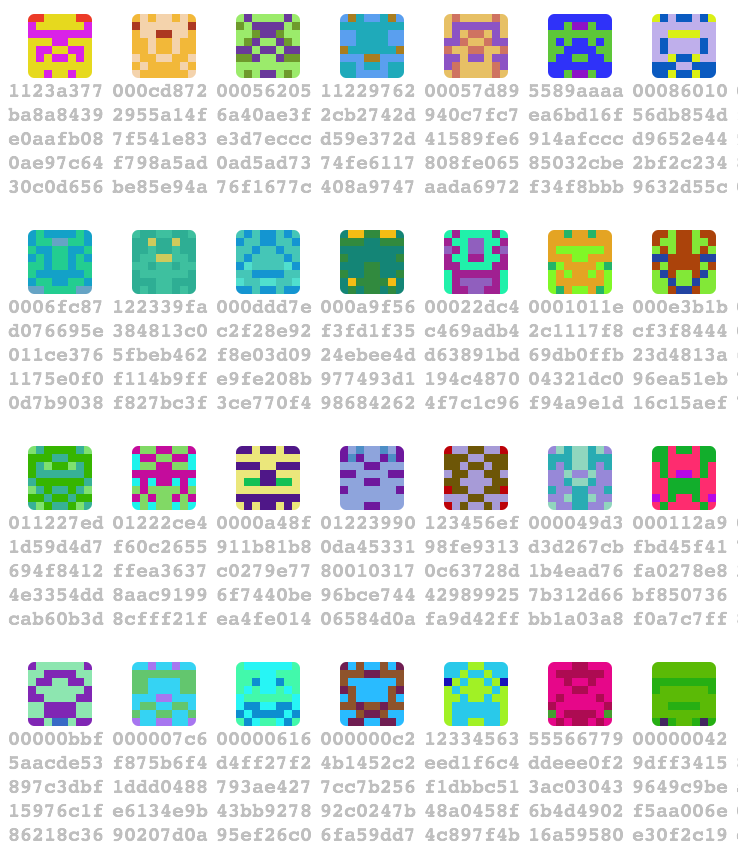

# vaniteth
Generates Ethereum vanity addresses

By default, generates vanity account addresses, using a set of built in scoring functions. You can choose the scoring functions to use with `--scorers`; valid options include:

 - `ascending`: Scores addresses on the length of ascending sequences (11122579...)
 - `strictAscending`: Scores addresses on the length of ascending sequences, with no gaps permitted (1122344...)
 - `target`: Scores addresses on closeness to the `--target` address, which defaults to 0.

Since generation is random, using multiple scoring functions helps find more interesting addresses, but since scoring functions take time to execute, it's best to leave out ones you're definitely not interested in.

Pull requests for more scoring functions are most welcome.

To generate contract addresses instead of account addresses, supply the flag `--contract`. The flag `--maxnonce` accepts an integer value for the maximum nonce (number of sent transactions) from the owning address to search for. Generating new addresses for an account is much faster than generating a new account, so searching many nonces is quicker. However, an address with a large nonce will require sending a lot of dummy transactions from the owning account before sending the desired one. The default value is 32.

Output is a newline separated list of mined addresses, nonces (if in contract mode) and raw private keys. Only addresses that are as good as or better than the current best result are output.

A docker image for this binary is available on dockerhub [here](https://hub.docker.com/r/arachnid/vaniteth/).

#### Icon visualizer

You can further select addresses by the icon they output. You can't automate this judgement (yet) but you can visualize them all by simply cloning the repository, adding a list of adresses to the `vanity-address-sampler.html` file as a json format and then running it in the webbrowser.

